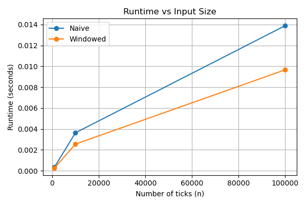
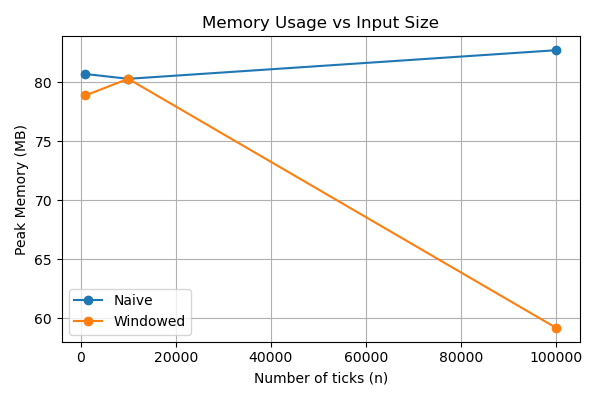

# Runtime & Space Complexity in Financial Signal Processing

## 1. Overview

This report analyzes the runtime and space complexity of two moving average trading strategies:

- NaiveMovingAverageStrategy
- WindowedMovingAverageStrategy

We evaluate their theoretical complexity and empirical performance using runtime profiling and peak memory measurements on increasing input sizes and the goal is to understand how algorithmic design choices affect both execution time and memory usage in financial systems.

## 2. Experimental Setup

### Dataset

- Data: Hourly Apple stock price data generated by Chatgpt (100k rows)
- Format: CSV with columns (timestamp, symbol, price)
- Input sizes tested:
  - 1,000 ticks
  - 10,000 ticks
  - 100,000 ticks

### Profiling Tools

- Runtime: `timeit.timeit`
- Peak Memory: `memory_profiler.memory_usage`
- Visualization: `matplotlib`

(each experiment processes the full sequence of ticks using a fresh strategy instance.)

## 3. Strategy Descriptions & Theoretical Complexity

### 3.1 NaiveMovingAverageStrategy

For each tick, the strategy recomputes the moving average by summing all historical prices stored so far.

- Time per tick: O(n)
- Total time over n ticks: O(n²)
- Space: O(n) (stores full price history)

### 3.2 WindowedMovingAverageStrategy

The strategy maintains a fixed-size sliding window of size k and updates the rolling sum incrementally.

- Time per tick: O(1)
- Total time over n ticks: O(n)
- Space: O(k), where k is the window size (constant)

This strategy is designed to optimize both runtime and memory usage.

## 4. Runtime Results

### 4.1 Runtime Table

| Input Size (ticks) | Naive Runtime (s) | Windowed Runtime (s) |
|-------------------|------------------|---------------------|
| 1,000             | 0.000353 s       | 0.000258 s          |
| 10,000            | 0.003631 s       | 0.002547 s          |
| 100,000           | 0.013880 s       | 0.009657 s          |

### 4.2 Runtime Scaling Plot

The following figure shows runtime versus input size for both strategies:

### 4.3 Runtime Analysis

The naive strategy exhibits rapidly increasing runtime as input size grows, consistent with its O(n²) total time complexity.
In contrast, the windowed strategy scales approximately linearly with n, matching its O(n) theoretical complexity.

This demonstrates the significant performance improvement achieved by incremental updates.

## 5. Memory Results

### 5.1 Peak Memory Table

| Input Size (ticks) | Naive Peak Memory (MB) | Windowed Peak Memory (MB) |
|-------------------|------------------------|---------------------------|
| 1,000             | 80.70 MB               | 78.89 MB                  |
| 10,000            | 80.30 MB               | 80.30 MB                  |
| 100,000           | 82.72 MB               | 59.20 MB                  |

### 5.2 Memory Scaling Plot

The following figure shows peak memory usage versus input size:

### 5.3 Memory Analysis

Although the naive strategy theoretically uses O(n) space and the windowed strategy uses O(k) space, the measured peak memory is dominated by the baseline memory of the Python process and profiling overhead.

As a result, peak memory does not increase monotonically with n and remains within a narrow range.

## 6. Optimization Impact

The windowed strategy achieves improvements over the naive approach:

- Runtime is reduced from quadratic scaling to linear scaling.
- Memory usage is bounded by a constant window size instead of growing with n.

These results highlight how maintaining a fixed-size buffer and incremental updates dramatically improve scalability in streaming financial systems.

## 7. Conclusion

This experiment demonstrates that:

- Algorithmic design choices have a major impact on performance.
- The naive recomputation approach does not scale to large datasets. 
- The optimized windowed strategy satisfies both runtime and memory constraints for large input sizes.

These findings confirm the importance of complexity-aware design when building real-time trading infrastructure.